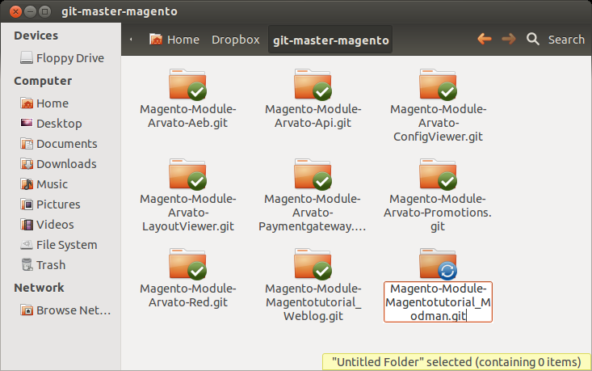
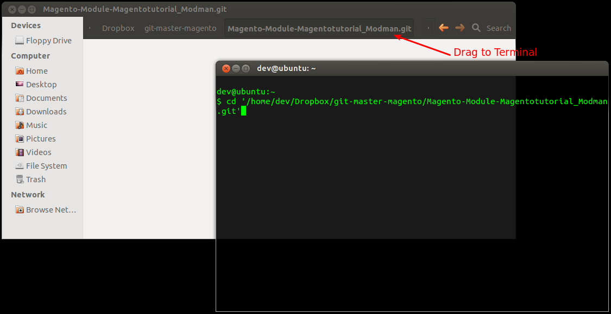
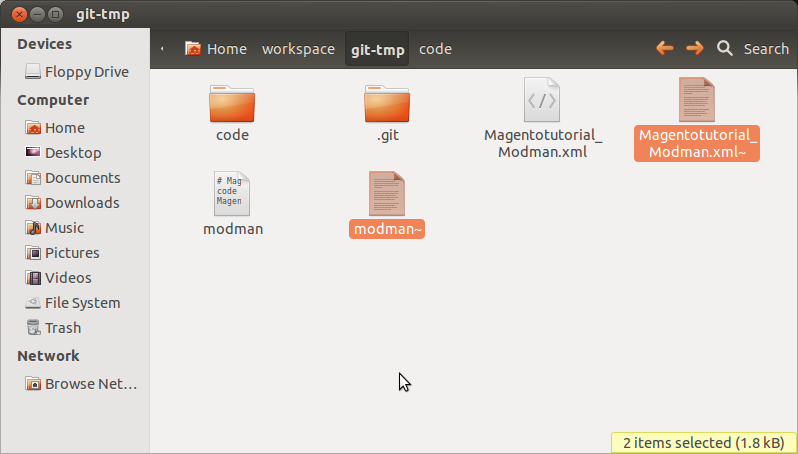
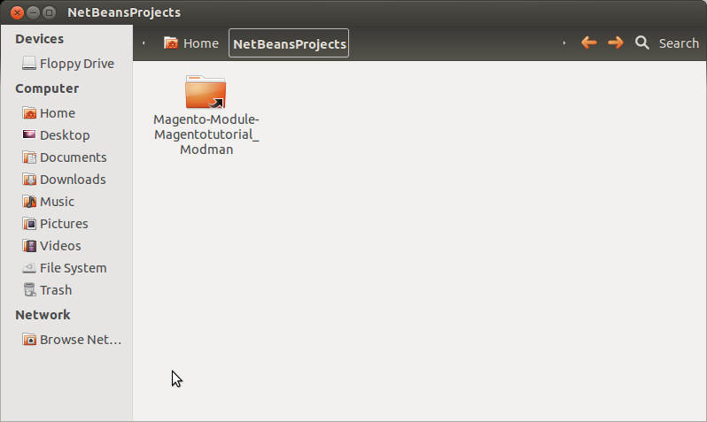
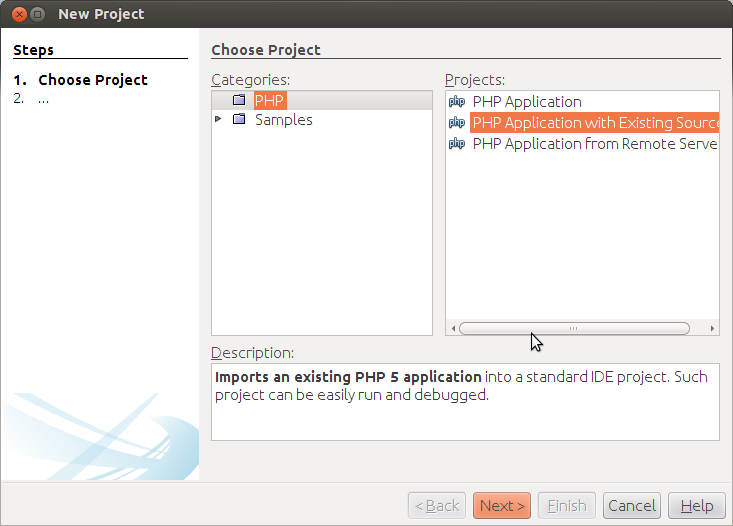
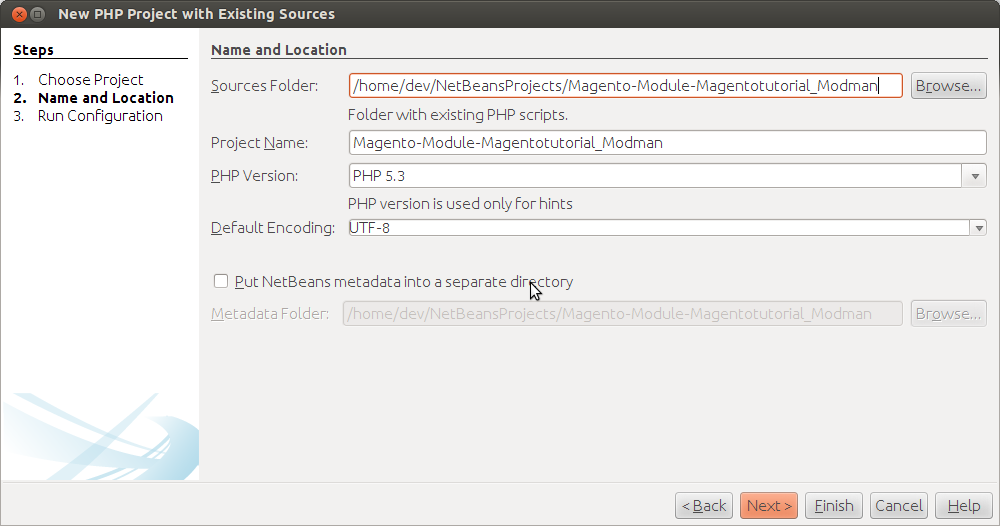
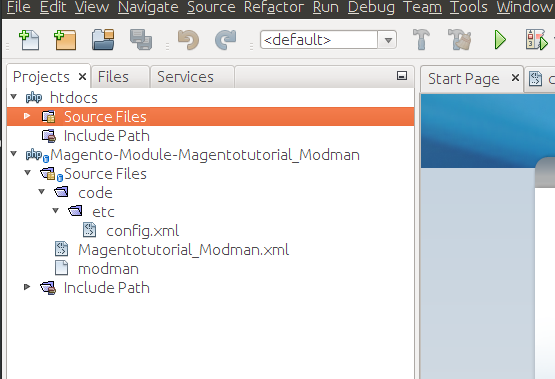
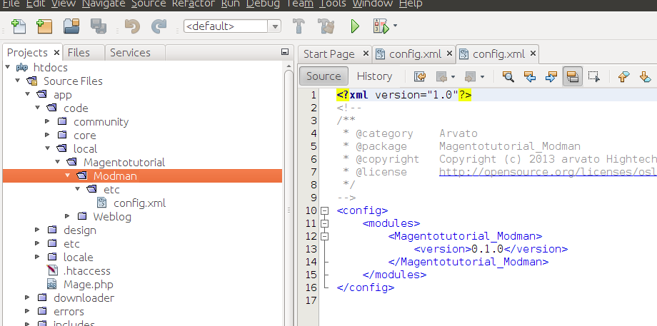

# Setting up git and modman for a new module
## Create a new git bare repository

Let's assume we want to create a new module "Magentotutorial_Modman"

Open a Nautilus and navigate to "/home/dev/Dropbox/git-master-magento" directory.
Create a new folder named "Magento-Module-Magentotutorial_Modman.git" in the git master directory.

Open Terminal and navigate into the new folder and create a git bare repository.
Note: You can drag the folder or folders name from the navigation bar into the terminals command line to insert the full path.

<!-- language: lang-bash -->
	cd '/home/dev/Dropbox/git-master-magento/Magento-Module-Magentotutorial_Modman.git'
    git init --bare

Check the folder content in Nautilus. It should look like this:

## Create a temporary local repository clone

Open a console and create a temporary directory a local git repository.

<!-- language: lang-bash -->

	 cd /home/dev/workspace
	 mkdir git-tmp
	 cd git-tmp
	 git init

Add the previously created bare repository as remote repository.

<!-- language: lang-bash -->
	git remote add origin /home/dev/Dropbox/git-master-magento/Magento-Module-Magentotutorial_Modman.git

Navigate to the git-tmp folder in Nautilus. Then create Magentotutorial_Modman.xml with folliwing content:

<!-- language: lang-xml -->
	<config>
	    <modules>
	        <Magentotutorial_Modman>
	            <active>true</active>
	            <codePool>local</codePool>
	        </Magentotutorial_Modman>
	    </modules>
	</config>

Create the filed named "modman" with following content:

<!-- language: lang-txt -->
	# Magentotutorial Modman
	code                                        app/code/local/Magentotutorial/Modman/
	Magentotutorial_Modman.xml         			app/etc/modules/Magentotutorial_Modman.xml

Create there an folder named "code". Inside this folder create a new folder named "etc".
Inside this folder create "config.xml" with following content:

<!-- language: lang-xml -->
	<config>
	    <modules>
	        <Magentotutorial_Modman>
	            <version>0.1.0</version>
	        </Magentotutorial_Modman>
	    </modules>
	</config>

Remove the temporary files if exists. These files containing "~" at the end.
Note: Use the shortcut "CTRL + H" to display hidden files in the Nautilus:

Add and commit local changes

<!-- language: lang-bash -->
	git add .
	git commit -am "modman init"

Push the change to the origin (bare repository)
	
<!-- language: lang-bash -->

	git push origin master

## Create a clone by using modman

Open a console and navigate to the Magento's htdocs directory

<!-- language: lang-bash -->
	cd '/var/www/vhosts/magento-dev.arvato-hightech-ecommerce.com/htdocs'

Create inside this folder a ".modman" directory and clone a new repository from the bare repository by using following commands

<!-- language: lang-bash -->
	modman init
	modman clone '/home/dev/Dropbox/git-master-magento/Magento-Module-Magentotutorial_Modman.git' 

## Configure netbeans for the new repository

Swith to NetBeansProjects folder and create symbolic link to modman's module clone:

<!-- language: lang-bash -->
	cd '/home/dev/NetBeansProjects'
	ln -s '/var/www/vhosts/magento-dev.arvato-hightech-ecommerce.com/htdocs/.modman/Magento-Module-Magentotutorial_Modman' 

Observe the NetBeansProjects directory. It looks like this:

Create a new project under File->New Project and select PHP Application from Existing Sources

Paste the path of the newly created link to modman module and click on "Finish" button

This is how your new Netbeans project tabs should look like:

This is how your Netbeans project "htdocs" tabs should look like:

---

language: en
date: 2013-04-11
tags: Magento, modman, Deployment