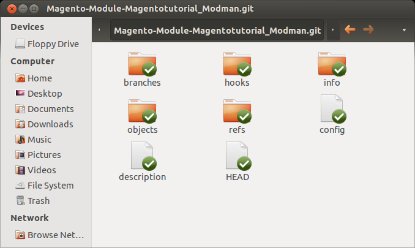
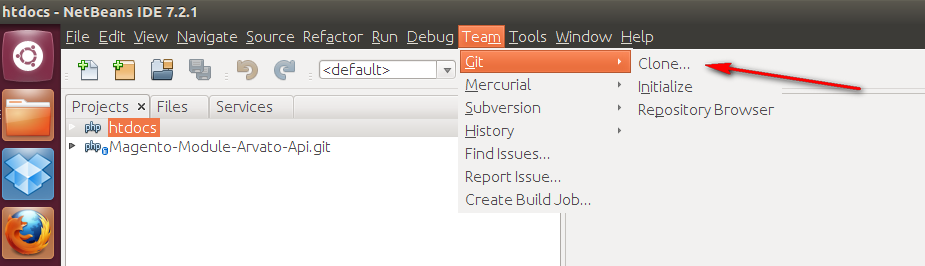
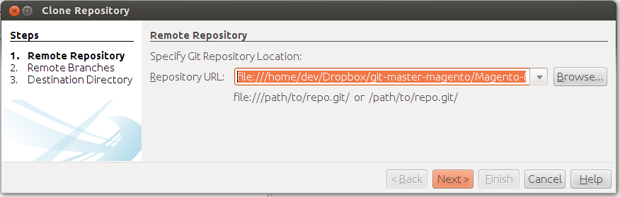
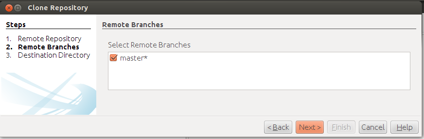
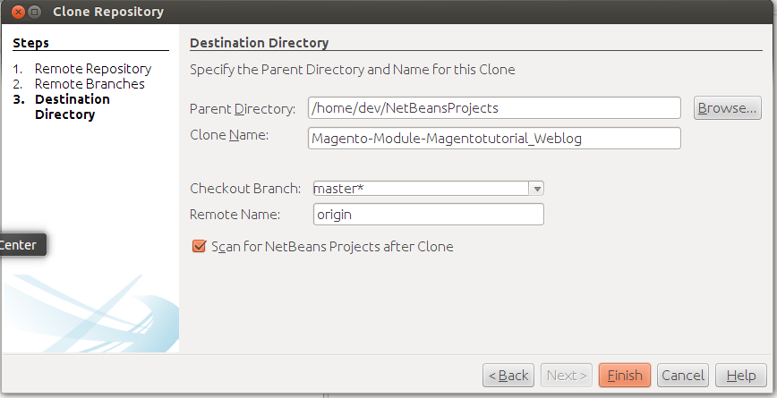
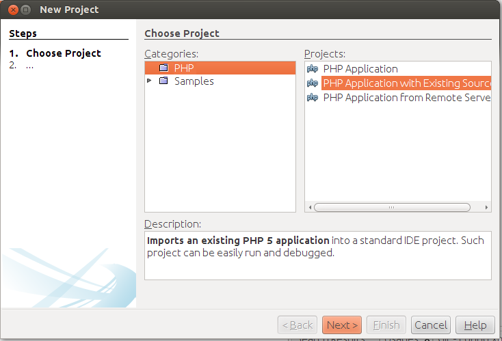
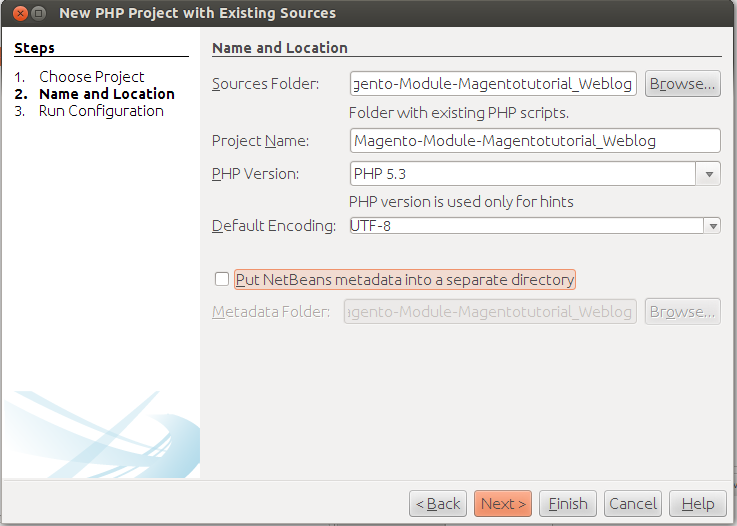
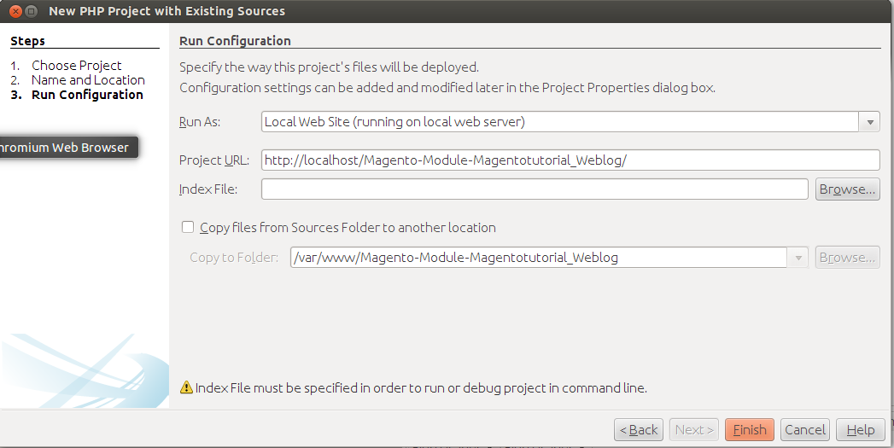
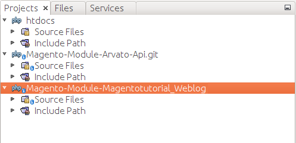

# Setting up git and modman for a new module
## Create a new git bare repository

Let's assume we want to create a new module "Magentotutorial_Weblog"

Open a console, create a new folder in the git master directory

<!-- language: lang-bash -->
	
	cd /home/dev/Dropbox/git-master-magento
	mkdir Magento-Module-Magentotutorial_Weblog.git

Navigate into the new folder and create a git bare repository.

<!-- language: lang-bash -->

	cd "Magento-Module-Magentotutorial_Weblog.git"
    git init --bare

## Create a temporary local repository clone

Open a console and create a temporary directory a local git repository.

<!-- language: lang-bash -->

	 cd /home/dev/workspace
	 mkdir git-tmp
	 cd git-tmp
	 git init

Add the previously created bare repository as remote repository.

<!-- language: lang-bash -->

	git remote add origin /home/dev/Dropbox/git-master-magento/Magento-Module-Magentotutorial_Weblog.git

Apply a local change

<!-- language: lang-bash -->

	touch newfile.txt
	git add .
	git commit -am "first local change"

Push the change to the origin (bare repository)
	
<!-- language: lang-bash -->

	git push origin master

## Configure netbeans for the new repository

Open the clone wizard

Select the path od the bare repository

Select the branch (there should only be master for now)

Select a path for the netbeans project (can stay as is, but copy the path for later)

Now Netbeans asks you wether you want to create a new project. - This is the same wizard as File->New Project.

Select PHP Application from Existing Sources

Paste the path of the newly created netbeans project

Just click continue and leave everything as is.

This is how your Netbeans project tabs should look like:

---

language: en
date: 2013-03-15
tags: Magento, modman, Deployment