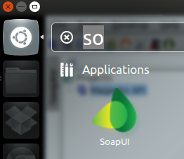

# Install Soap UI on Ubuntu

To install SoapUI (4.5.0) under Ubuntu 12.04/11.10, open the terminal and run the following commands:

	sudo add-apt-repository ppa:upubuntu-com/web
	sudo apt-get update
	sudo apt-get install soapui

You can now start the application from the Unity Dash:

---

language: en
date: 2013-03-25
tags: Soapui