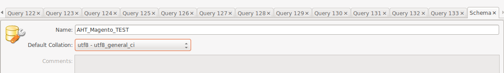
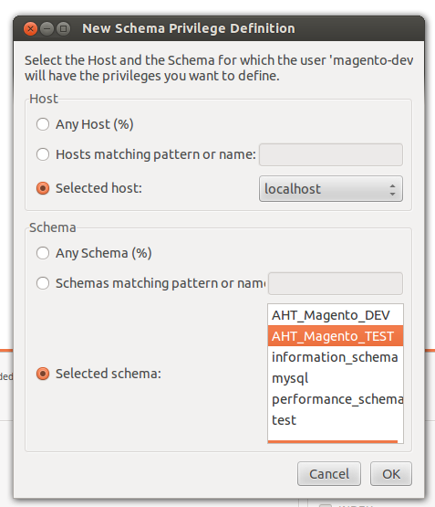

# Unit testing Magento

The library for unit tests in PHP is called PHPUnit. In addition, there exists a Magento module which provides many useful methods to properly test your own Magento modules.
It creates a separate test database, so your data is not compromised during the unit tests.

## Installing PHPUnit

In a terminal, enter the following commands to install PHPUnit using pear:
<!-- language: lang-sh -->
	sudo pear config-set auto_discover 1
	sudo pear install pear.phpunit.de/PHPUnit

Afterwards, we need to install some additional PHPUnit modules which are required for our tests:
<!-- language: lang-sh -->
	sudo pear install phpunit/DbUnit
	sudo pear install phpunit/PHP_Invoker
	sudo pear install phpunit/PHPUnit_Selenium
	sudo pear install phpunit/PHPUnit_Story
	sudo pear install phpunit/PHPUnit_SkeletonGenerator

After these steps, PHPUnit is ready to be used. We will now setup the Magento part for testing.

## Installing the Ecomdev Magento extension

[Short introduction to extension](http://www.ecomdev.org/2011/02/01/phpunit-and-magento-yes-you-can.html)

[Git repository of module](https://github.com/IvanChepurnyi/EcomDev_PHPUnit)

Using modman, clone the git repository of the module into your shop instance

<!-- language: lang-sh -->

	cd /var/www/vhosts/magento-dev.arvato-hightech-ecommerce.com/htdocs/
	modman clone git://github.com/IvanChepurnyi/EcomDev_PHPUnit.git

Now we need to configure the module, so it copies all Magento tables into a separate database and does not interfere with our database when we are running unit tests. To do this, we will first create a new database and give the Magento database users all permissions on the test database:

- Open your Mysql Workbench
- Double click on your connection "aht-dev-server" to open the existing databases
- In the top menu panel click on the database symbol "Create a new schema in the connected server" and enter the following data:

- We now go back to the home tab (icon with house in upper left corner) to set the permissions for the new database
- Click on "manage security" in lower right corner in home area
- In left menu choose "Users & Privileges", then switch to tab "Schema Privileges"
- Click on the "magento-dev" user which is the user whom we want to grant rights to the new test db
- Click "Add Entry" and choose the new db with localhost:

- After confirming with OK, click the button "Select ALL" on the bottom of the page and finally "Save Changes"

We now have the new db schema with the necessary permissions and can finally configure our extension. 
In Netbeans, navigate to your shop project and find the file "local.xml.phpunit" in the folder app/etc/

Edit the XML as follows:

<!-- language: lang-xml -->

	<?xml version="1.0"?>
	<config>
	    <global>
	        <resources>
	            <default_setup>
	                <connection>
	                    <dbname><![CDATA[AHT_Magento_TEST]]></dbname>
	                </connection>
	            </default_setup>
	        </resources>
	    </global>
	    <default>
	        <web>
	            <seo>
	                <use_rewrites>1</use_rewrites>
	            </seo>
	            <secure>
	                <base_url>https://magento-dev.arvato-hightech-ecommerce.com/</base_url>
	            </secure>
	            <unsecure>
	                <base_url>http://magento-dev.arvato-hightech-ecommerce.com/</base_url>
	            </unsecure>
	            <url>
	                <redirect_to_base>0</redirect_to_base>
	            </url>
	        </web>
	    </default>
	    <phpunit>
	        <allow_same_db>0</allow_same_db>
	    </phpunit>
	</config>

The module is now setup and we can run it to create all the tables in the new test database (this will take a few minutes). 
In the console:

<!-- language: lang-sh -->	
	cd /var/www/vhosts/magento-dev.arvato-hightech-ecommerce.com/htdocs/
	phpunit

If you see a message that there were no tests found, your extension is installed successfully.

## Setting up tests for a module

To let the Ecomdev module know that your module contains tests, we need to add some lines to your module's config.xml file in the folder etc within your modules code folder:

<!-- language: lang-xml -->
	<config>
		<!-- ... Other stuff which is already there ... -->
	    <phpunit>
	        <suite>
	            <modules>
	                <Arvato_YourModule />
	            </modules>
	        </suite>
	    </phpunit>
	</config>

Inside your module's code folder, create a folder called "Test" - within this folder, we will keep all module specific unit tests. It contains sub-directories for our different test groups:

- **Model** for test cases related to models
- **Block** for test cases related to blocks that can be tested in isolation
- **Helper** for test cases related to helpers
- **Controller** for test cases related to controller actions together with layout and blocks
- **Config** for test cases related to your module configuration file definitions

The naming of your test files corresponds to this structure and the Magento naming conventions:

Your test case class should be named in such a way:
`[Arvato_YourModule]_Test_[Group Directory]_[ClassToTest]`
For example if we want to test the Model `OrderCreation` in the `Arvato_Red` module, then our filename in the test will be `Arvato_Red_Test_Model_OrderCreation` and the file will be in the folder `Test/Model/OrderCreation.php`

## Writing tests

There are three classes from which you can extend to be able to write tests:

- **`EcomDev_PHPUnit_Test_Case`** is the default test case to test models, blocks and helpers
- **`EcomDev_PHPUnit_Test_Case_Controller`** is the default test case to test controlllers and the layout rendering
- **`EcomDev_PHPUnit_Test_Case_Config`** is the default test case to test the configuration (Mage::getStoreConfig())

Let us look at a small sample test of the aeb webservice model:

<!-- language: lang-php -->
	<?php
	class Arvato_Aeb_Test_Model_Webservice extends EcomDev_PHPUnit_Test_Case
	{
	    /**
	     * Get the model under test with path hinting
	     * @return Arvato_Aeb_Model_Webservice
	     */
	    private function _getModel()
	    {
	        return Mage::getModel('arvato_aeb/webservice');
	    }

We are extending from `EcomDev_PHPUnit_Test_Case` to be able to use specific Magento mocking.
It is usually a good idea to have a method (here: `_getModel()`) to get the model under test, so we can specify the `@return` value, so Netbeans can use "Intellisense" on the model.

Now for our first test:

<!-- language: lang-php -->
	    /**
	     * @test
	     */
	    public function isCompliant_WebserviceReturnsEmptyClass_ReturnsTrue() 
	    {
	        // Arrange
	        $model = $this->_getModel();
	        $returnValue = $this->returnValue(new stdClass());
	        $this->_mockClient($returnValue);
	        $address = $this->_getOrderAddress();
	
	        // Act
	        $compliant = $model->isCompliant($address);
	        
	        // Assert
	        $this->assertTrue($compliant);
	    }

- @test in the comment above a public function specifies that we want to run this as a unit test
- There are several functions for assertions, e.g.
	- assertTrue($var)
	- assertFalse($var)
	- assertEquals($var1, $var2)
	- assertNotNull($var)
	- assertNull($var)
	- assertContains($needle, $haystack)
	- assertGreaterThan($expected, $actual)
	- See [Detailed list and usage of PHPUnit assertions](http://www.phpunit.de/manual/3.7/en/writing-tests-for-phpunit.html#writing-tests-for-phpunit.assertions)
- Besides nicely separating our tests within the Test folder of our module, the EcomDev module, helps us in the mocking which is here hidden in the method `_mockClient`, which was implemented as follows:

<!-- language: lang-php -->
		/**
		 * Get a mocked webservice client which returns $returnValue when its method
		 * getMatchingAddressesFor is called
		 * @return Arvato_Aeb_Model_Webservice_Client
		 */
	    private function _mockClient($returnValue) 
	    {
	        $mock = $this->getModelMock('arvato_aeb/webservice_client');
	        $mock->expects($this->any())
				 ->method('getMatchingAddressesFor')
	             ->will($returnValue);
	        $this->replaceByMock('singleton', 'arvato_aeb/webservice_client', $mock);
	    }
	} // End of class

- EcomDev provides methods to mock specific Magento types:
	- **`getModelMock($classAlias)`**  creates a new mock object by the Magento model class alias (Mage::getModel($classAlias))
	- **`getResourceModelMock($classAlias)`** like getModelMock but for resource models
	- **`getBlockMock($classAlias)`** like getModelMock but for blocks
	- **`getHelperMock($classAlias)`** like getModelMock but for helpers (Mage::helper($classAlias))
- You can use this mock for example if you pass an object into a function or into a constructor
- But even cooler: we can tell EcomDev to replace all Mage::getModel(), Mage::helper() etc calls to return our created mock. This is done by the method `replaceByMock($type, $classAlias, $mockObject)` where `$type` is one of (`'model'`, `'resource_model'`, `'singleton'`, `'resource_singleton'`, `'helper'`, `'block'`)

## Helpful resources and further information

**Fixtures**

Using a fixture, you can pass in values into Magento's configuration and into the database.
To use a fixture in a test, simply add the tag @loadFixture to the comment before your test method.
Then you need a folder with the name of your test filename according to Magento standards and inside it a fixtures folder. So let's say our test is `Arvato_Module_Test_Model_My_Test_Model` then, the folder would be `Test/Model/My/Test/Model/fixtures`. Inside of the fixtures model, we create a yaml file named exactly like our test method. Take this example:

<!-- language: lang-php -->
	/**
	 * @loadFixture
	 * @test
	 */
	public function testIfTheAnswerToTheUniverseIs42()
	{
	  //... your test
	}

We would thus need the file 'testIfTheAnswerToTheUniverseIs42.yaml' inside our fixtures folder of this test file.
Inside of the yaml file, we can specify the content of our tables (here creating two orders with id 5 and 7 in the `sales_flat_order` table):

<!-- language: lang-yaml -->
	tables:
	  sales/order:
	    - entity_id: 5
	      state: processing
	      status: processing
	    - entity_id: 7
	      state: processing
	      status: processing

...as well as our configuration values:

<!-- language: lang-yaml -->
	config:
  		default/payment/arvato_paymentgateway/due_days: 5

In this example the method Mage::getStoreConfig('payment/arvato_paymentgateway/due_days') would return the value 5 during our test - whereever it is called! The default prefix can be altered to be more store specific.

**In-depth mocking**

When creating mocks, the EcomDev extension relies largely on all the functionality which is already provided by PHPUnit, so it makes sense to read the PHPUnit documentation to understand all the possibilities of testing. Especially the mocking part is very powerful and can be found here:
[PHPUnit documentation test doubles](http://www.phpunit.de/manual/3.8/en/test-doubles.html)

Since some use cases occur often, the most relevant ones are demonstrated here:

- $mock->expects($expectation) parameter $expectation can be:
	- $this->any()
	- $this->once()
	- $this->never()
	- $this->atLeastOnce()
	- $this->exactly($count)
	- $this->at($index)
- to further verify the parameters with which the method is called, you can use ->with($parameters):
	- $this->anything()
	- $this->greaterThan($value)
	- $this->isInstanceOf($className)
	- $this->stringContains($string)
	- $this->equalTo($var)
- and to specify what the method returns use ->will($return) with:
	- $this->returnValue($var)
	- $this->throwException($exception)
	- $this->onConsecutiveCalls(...) - Specify what should be returned in first call, second call, ...

Three examples:
<!-- language: lang-php -->
	$mock->expects($this->once())
	     ->method('getPizza')
	     ->with($this->equalTo('salami'))
	     ->will($this->returnValue(new SalamiPizza()))
	// Method getPizza('salami') has to be called exactly once during test and will return new SalamiPizza() when called
	// Test fails if called never or more than once or if with different parameters

	$mock->expects($this->any())
	     ->method('getPizza')
	     ->with($this->equalTo('surprise-me'))
	     ->will($this->onConsecutiveCalls($this->returnValue(new HawaiiPizza()), $this->returnValue(new SpinachPizza())))
	// Method getPizza('surprise-me') can be called 0-N times during test.
	// It will return new HawaiiPizza() on first call and new SpinachPizza() on second call
	// Test fails if called with different parameters
	
	$mock->expects($this->never())
		 ->method('getPizza');
	// Method getPizza() is never called.
	// Test fails if it is called 1-N times

**And much more...**

There are many more possibilities like:

- data providers to repeatedly call test methods with different values (@dataProvider annotation)
- expectations to get expected values in your test (@loadExpectation annotation)
- EAV values
- Indexers
- Block, configuration and controller test cases

To get started, read the manual of the EcomDev Magento extension which can be found at:

[EcomDev Magento with PHPUnit extension manual](http://www.ecomdev.org/wp-content/uploads/2011/05/EcomDev_PHPUnit-0.2.0-Manual.pdf)

Furthermore, the extension builds on top of PHPUnit and extends it, so many basic resources are in the PHPUnit documentation:

[PHPUnit 3.8 manual English](http://www.phpunit.de/manual/3.8/en/writing-tests-for-phpunit.html)

---
date: 2013-04-17
tags: PHP, UnitTests, Magento
language: en