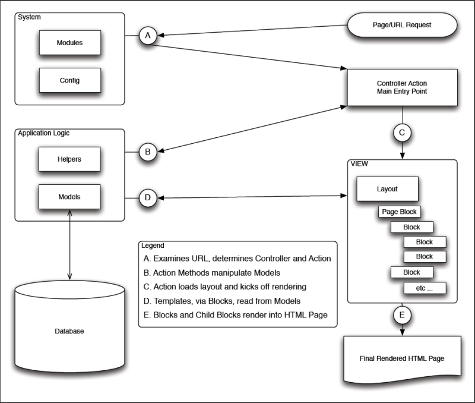
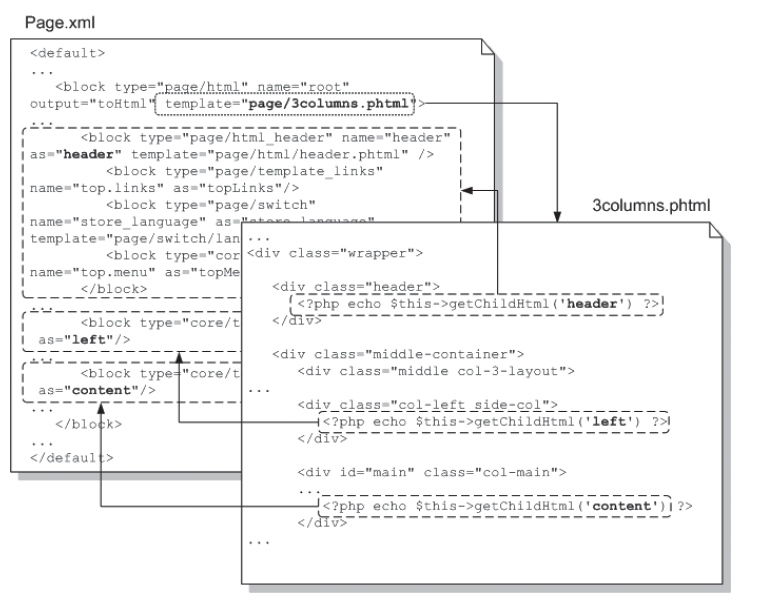
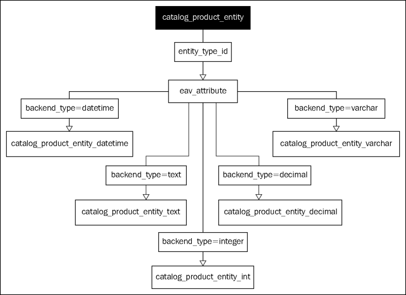

#  Tutorial objectives
* Understand the Magento Company and Products
* Have a rough understanding of most important Magento concepts 
* know how files are organized
* know the basic tasks for extending Magento
 
#  Who is Magento - A Company-Overview ##
 * 100%-owned by ebay since 2010
 * Subbrand listed under x.commerce
 * Headquarter in Los Angeles (USA)
 * Local subsidiaries in Berlin, London, Brussels and Dublin
 * Employee-count: ca. 400
 * > 150.000 installations world-wide
 
### Relating Magento to ebay:

## How are they doing development?

 * 2 editions available - Community Edition (CE) and Enterprise Edition (EE)
 * Both editions are developed by the Magento company itself, whereas the CE is always a few versions behind the EE
 * Apart from the version difference, EE contains more default extensions than CE

### Enterprise Only Features

* SolR search (but extensions for CE available)
* Customer segmentation with targeted offerings
* Dynamic, rule-based product relationships
* Automatic e-mail reminders
* Private sales for customer groups (incl. invitation)
* Gift registry
* Gift wrap option
* Rebate points modul
* Several wishlists per customer
* Enhanced catalog and content management system (CMS+)
* Staging, merging and rollback of content
* Scheduled publishing of pages
* Customer-specific profile attributes
* Improved performance (but you can achieve this with Varnish for CE)
* Payment bridge
* Data encrpytion and key management
* Call center with assisted shopping
* Minimum advertised price
* Full-page caching
* Customer segmentation with targeted offerings
* Recurring payments
* Full page caching

### Magento Connect  
URL: [http://www.magentocommerce.com/magento-connect/](http://www.magentocommerce.com/magento-connect/ "http://www.magentocommerce.com/magento-connect/")

## General Magento Concepts

* Magento is based on OOP and the Zend framework
* Module-based architecture
* Event-driven architecture
* Configuration-based

### MVC
 * Configuration-based routing
 * Configuration-based views (layout + blocks)
 * Thin controllers
 * Models contain business logic   
   
   

### The Filesystem

**Top-Level** 
/ app - This is where the big stuff happens :) 
/ skin / {area} / {package} / {theme} / - is where design package css and images are 
/ lib - libraries such as Zend and Varien 
/ js - where you put your JavaScripts 
/ media - uploaded files (product images, PDF documents, etc.) 
/ tests - Unit tests (not done yet) 
/ var - temporary files 
/ includes - contains config.php 

**Inside the app folder** 
/ app / etc - global configuration. Register your module with the system here 
/ app / code - is where modules have installed their models and controllers 
/ app / design - is location of design packages (layouts, templates, translations) 
/ app / locale - locale files 
 
**App code pools** 
/ app / code / core - are core team developed or certified modules 
/ app / code / community - are community contributed modules 
/ app / code / local - are local customizations 
 
**App design-reated** 
/ app / design / frontend - frontend design 
/ app / design / adminhtml - HTML admin panel design 
/ app / design / {area} / {package} / {theme} - theme customizations 
/ app / design / {area} / {package} / {theme} / layout - .xml files that define block structure for different cases in website flow 
/ app / design / {area} / {package} / {theme} / template - .phtml (html with php tags) templates 
/ app / design / {area} / {package} / {theme} / locale - Zend_Translate compatible translation files for package/theme 

/ app / locale / {locale (en\_US)} - Zend_Translate compatible translation files for modules 

**The Module structure** 
/ {Your  Code pool} / {Module} - module root 
/ {Your  Code pool} / {Module} / etc - module configuration 
/ {Your  Code pool} / {Module} / controllers - controllers provided by module 
/ {Your  Code pool} / {Module} / Block - Block logic classes 
/ {Your  Code pool} / {Module} / Model - Object models provided by module 
/ {Your  Code pool} / {Module} / Model / Mysql4 - Resource models provided by module 
/ {Your  Code pool} / {Module} / sql - SQL installation and upgrade files between module versions 
/ {Your  Code pool} / {Module} / sql / {resource} / - Resource model specific upgrades 

### Layout System

Layout and design are separated from each other. 

####Important terms
**Design package**: is a collection of related themes. Each design package must have at least one default theme, but can contain any number of theme variants. (Christmas, holidays, etc.) /app/design/frontend/…

**Base package**: A special package that contains all the default elements for a Magento installation. 

**Default package**: This contains the layout elements of the default store (look and feel).

**Theme**: Part of a design package. Contains layout files, template files and locales (optional). A theme can belong to only one design package. Every theme automatically includes 4 basic layouts (one column, two columns with left sidebar, two column with right sidebar, three columns)

**Skin**: CSS, images, JavaScripts. Skins reside in a separate root folder named “Skin”. (Similar sub-tree like app/design)

**Layout-Files**: Define the hierarchical structure of a page (footer, header, content, …) – XML Files. The structure is defined by handles, blocks and actions. A layout file has always a `<layout>` root node. The first child-level of this nodes are the “handles” (also called layout objects.). 

**Handles** are instantiated by the application controllers' action methods, and so the application logic decides which blocks to display. For doing that the controller code calls `$this->loadLayout()` and `$this->renderLayout()`. Handles contain blocks, which are the most important structural elements.

 

**Blocks:** Blocks can be seen as view models. Most blocks have a corresponding template file. Blocks contain PHP logic, templates contain HTML and PHP output code. Blocks refer directly back to the models for their data. In other words, the action controller does not pass them a data structure.
Blocks are hierarchical. Each block can contain any number of child blocks.

**Template-Files**: PHTML Files. – They define where the defined areas of the layout file appear in the rendered HTML page. To all of those files together, the documentation refers to as “template”.  *Note:* Whenever we use the `$this` keyword, we reference the instance of the related block object.

   

### Models
Magento models do not only contain data, but also the business logic (rich models), so usually the models are the most complex parts of a Magento solution.

#### Object Relational Mapping (ORM)

Magento models support Object Relational Mapping (ORM). Both the built in models and your own models use the Magento data access capabilities, so that no plain SQL has to be written by developers.

Magento supports two kinds of models:

* ActiveRecord-like one-object-one-table models
* Entity Attribute Value (EAV) models

Each Magento model has also a model collection, which are similar to .NET collections (e.g. they can be used in for/as (= foreach in C#) loops.

Magento models do *not* contain any code for accessing the database directly, but they use a `modelResource` class to communicate with the database. Internally, one read and one write adapter is used.

#### Creating a Model

These are typical steps for creating a model that can be persisted in the database (we will perform these steps later on in the exercise part of this developer meeting):

1. Create a new model class
2. Create a database table for the model
3. Add model information to the configuration file of the module
4. Add model resource information to the configuration file of the module
5. Add a Read Adapter to the configuration file of the module
6. Add a Write Adapter to the configuration file of the module
7. Add a PHP class/file for the model
8. Add a PHP class/file for the resource model
9. Instantiate the model via `Mage::getModel('<module_name>/<model_name>')`

#### Setting and Getting Data on Models

Magento models inherit from `Varien_Object`. This class implements some functionality to access model data (via magic getters/setters). Internally, the whole functionality is built on a protected `_data` property which is an associative array. The `getData()` method can be used to get the whole associative array or only certain keys:

    $model->getData();
    $model->getData('some_property');

All database column names should contain only lowercase characters and should use underscores to separate different words. Properties named in this way can be accessed directly via `get`, `set`, `unset`, `has`, and `is` like this (note that the `Varien_Object` camel-cases the property name):

    $model->getSomeProperty();
    $model->setSomeProperty('toSomeValue');
    $model->unsetSomeProperty();
    $hasSomeProperty = $model->hasSomeProperty();

In the exercise later on we will see how to retrieve data records from the database or how to save them.

#### The Entity Attribute Value Pattern (EAV)

For some entities (like products), Magento does not use simple (flat) database tables to store the information, but a more complicated, but highly flexible approach called Entity Attribute Value architecture (EAV). This makes the database structure a lot more complex, but it allows to add an unlimited number of attributes to entities without having to change the database schema.

The EAV model allows vertical data modeling instead of the mostly used horizontal data modeling, which means that if a entity shall be extended by a new property, this is done by adding data records to certain tables, and not by adding a column to an existing table.

Important terms:

* **Entity**: e.g. products, categories, customers, customer addresses, etc.
* **Attribute**: the names of the items which belong to an entity, e.g. the title or the description of a product. It is important to understand that an attribute table does not store the actual values, but only the metadata of the attributes.
* **Value**: store the actual values of the various attributes of the entities.

The following diagram shows the relationship between different database tables for products as an example:

Both the `catalog_product_entity` and the `eav_attribute` tables contain an `entity_type_id` column that is used to join the attributes to the product. The `eav_attribute` table contains a column `backend_type` that stores the datatype of the respective attribute. The actual values are stored in datatype specific tables like `catalog_product_entity_datetime`.

The EAV system is extendable by new entities, i.e. developers can create new EAV based entities.

**Pros and Cons**: EAV allows developers to extend the Magento system without the need to change existing data structures, so it adds a great deal of flexibility to the system. The downside is complexity and performance. The Magento base installation consists of more than 350 tables. In order to grab all the information for a single entity (like a product), a lot of different tables have to be joined together, which creates a lot of workload on the database.

In order to bypass the performance bottleneck, the Magento developers decided to "cache" the information from the EAV tables into so-called index or flat tables. For categories and products, this feature can be turned on in the Magento backend \(**System** | **Configuration** | **Catalog** | Expand **Frontend** | **Use Flat Catalog Category** and **Use Flat Catalog Product**).

## Developing a web log extension

Enough theory, it's time for a first module. This walktrough tutorial is mainly derived from [Alan Storms Magento Developer Tutorial Part 3 and 5](http://www.magentocommerce.com/knowledge-base/entry/magento-for-dev-part-3-magento-controller-dispatch). 

We're going to:

* Create a new "Weblog" module
* Create a database table for our model
* Register a new model
* Connect the model with the database - Register a resource model
* Add a Read Adapter to the config for the Blogpost model
* Add a Write Adapter to the config for the Blogpost model
* Add a PHP class file for the Blogpost model
* Add a PHP class file for the Blogpost resource model
* Instantiate the model

### Create a new module called "Weblog"

First, we'll create a directory structure for this module. Our directory structure should look as follows:

app/code/local/Magentotutorial/Weblog/Block 
app/code/local/Magentotutorial/Weblog/controllers 
app/code/local/Magentotutorial/Weblog/etc 
app/code/local/Magentotutorial/Weblog/Helper 
app/code/local/Magentotutorial/Weblog/Model 
app/code/local/Magentotutorial/Weblog/sql 

Then create a configuration file for the module (at path app/code/local/Magentotutorial/Weblog/etc/config.xml):

<!-- language: lang-xml -->

	<config>
	    <modules>
	        <Magentotutorial_Weblog>
	            <version>0.1.0</version>
	        </Magentotutorial_Weblog>
	    </modules>
	</config>

Then create a file to activate the module (at path app/etc/modules/Magentotutorial_Weblog.xml):

<!-- language: lang-xml -->
	
	<config>
	    <modules>
	        <Magentotutorial_Weblog>
	            <active>true</active>
	            <codePool>local</codePool>
	        </Magentotutorial_Weblog>
	    </modules>
	</config>

Finally, we ensure the module is active (Clear your Magento cache).

* In the Magento Admin, go to System->Configuration->Advanced.
* Expand "Disable Modules Output" (if it isn't already).
* Ensure that Magentotutorial_Weblog shows up.

### Create Action Controller(s) for our Routes

Create a file at app/code/local/Magentotutorial/Weblog/controllers/IndexController.php

That contains the following

<!-- language: lang-php -->

	class Magentotutorial_Weblog_IndexController extends Mage_Core_Controller_Front_Action {        
	
	    public function testModelAction() {
           echo 'Setup!';
        }
	
	}
	
### Configuring Routes
Next, we're going to configure a route. A route will turn a URL into an Action Controller and a method. Unlike other convention based PHP MVC systems, with Magento you need to explicitly define a route in the global Magento config.

In your config.xml file, add the following section:

<!-- language: lang-xml -->

	<config>    
	    ...
	    <frontend>
	       <routers>
	        <weblog>
	            <use>standard</use>
	            <args>
	                <module>Magentotutorial_Weblog</module>
	                <frontName>weblog</frontName>
	            </args>
	        </weblog>
	    </routers>
	    </frontend>
	    ...
	</config>

#### Understand the routing

The `<frontend>` tag refers to a Magento Area. There are mainly two of them: `<admin>` and `<frontend>`. 
The `<routers>` tag contains all custom registered routes. 

When a router parses a URL, it gets separated as follows

	http://example.com/frontName/actionControllerName/actionMethod/

So, by defining a value of "weblog" in the `<frontName>` tags, we're telling Magento that we want the system to respond to URLs in the form of

	http://example.com/weblog/*

This module tag should be the full name of your module, including its package/namespace name. This will be used by the system to locate your controller files.

#### Testing the registered action

Clear your config cache, and load the following URL

	http://exmaple.com/weblog/index/testModel
	
You should see the word "Setup" on a white background. Congratulations, you've setup your first Magento controller!

### Create a database table for our model

Magento has a system for automatically creating and changing your database schemas, but for the time being we'll just manually create a table for our Model.

Using the command-line or your favorite MySQL GUI application, create a table with the following schema

<!-- language: lang-sql -->

	CREATE TABLE `blog_posts` (
	  `blogpost_id` int(11) NOT NULL auto_increment,
	  `title` text,
	  `post` text,
	  `date` datetime default NULL,
	  `timestamp` timestamp NOT NULL default CURRENT_TIMESTAMP,
	  PRIMARY KEY  (`blogpost_id`)
	)

And then populate it with some data
	
	INSERT INTO `blog_posts` VALUES (1,'My New Title','This is a blog post','2010-07-01 00:00:00','2010-07-02 23:12:30');

### Register a new model

When you instantiate a model in Magento, you make a call like this

<!-- language: lang-php -->

	$model = Mage::getModel('weblog/blogpost');

The first part of the URI you pass into `getModel` is the Model Group Name. Because it is a good idea to follow conventions, this should be the (lowercase) name of your module, or to be safeguarded against conflicts use the package name and module name (also in lowercase). The second part of the URI is the lowercase version of your model name.

So, let's add the following XML to our module's config.xml.
	
<!-- language: lang-xml -->

	<global>
	    <!-- ... -->
	    <models>
	        <weblog>
	            <class>Magentotutorial_Weblog_Model</class>
	            <!--
	            need to create our own resource, can't just
	            use core_resource
	            -->
	            <resourceModel>weblog_resource</resourceModel>
	        </weblog>
	    </models>
	    <!-- ... -->
	</global>

`<weblog />` is your Group Name, which should match your module name. 
`<class />` is the base name all Models in the weblog group will have. 
`<resourceModel />` indicates which Resource Model that weblog group models should use.

So, we're not done yet, but let's see what happens if we clear our Magento cache and attempt to instantiate a blogpost Model. In your `testModelAction` method, use the following code

<!-- language: lang-php -->

	public function testModelAction() {
	        $blogpost = Mage::getModel('weblog/blogpost');
	        echo get_class($blogpost);
	    }
	
and reload your page. You should see an exception that looks something like this (be sure you've turned on developer mode).

	include(Magentotutorial/Weblog/Model/Blogpost.php) [function.include]: failed to open stream: No such file or directory

Magento is trying to __autoload include this Model, but can't find the file. Let's create it! Create the following class at the following location: `app/code/local/Magentotutorial/Weblog/Model/Blogpost.php`:

<!-- language: lang-php -->

	class Magentotutorial_Weblog_Model_Blogpost extends Mage_Core_Model_Abstract
	{
	    protected function _construct()
	    {
	        $this->_init('weblog/blogpost');
	    }
	}

		
### Connect the model with the database - Register a resource model

So, we've setup our Model. Next, we need to setup our Model Resource. Model Resources contain the code that actually talks to our database. In the last section, we included the following in our config.

	<resourceModel>weblog_resource</resourceModel>

The value in `<resourceModel />` will be used to instantiate a Model Resource class. Although you'll never need to call it yourself, when any model in the weblog group needs to talk to the database, Magento will make the following method call to get the Model resource:

	Mage::getResourceModel('weblog/blogpost');

Again, weblog is the Group Name, and blogpost is the Model. The `Mage::getResourceModel` method will use the weblog/blogpost URI to inspect the global config and pull out the value in `<resourceModel>` (in this case, `weblog_resource`). Then, a model class will be instantiated with the following URI:

	weblog_resource/blogpost

So, if you followed that all the way, what this means is, resource models are configured in the same section of the XML config as normal models. This can be confusing to newcomers and old-hands alike.

So, with that in mind, let's configure our resource. In our `<models>` section add

<!-- language: lang-xml -->

	<global>
	    <!-- ... -->
	    <models>
	        <!-- ... -->
	        <weblog_resource>
	            <class>Magentotutorial_Weblog_Model_Resource</class>
	        </weblog_resource>
	    </models>
	</global>

You're adding the `<weblog_resource />` tag, which is the value of the `<resourceModel />` tag you just setup. The value of` <class />` is the base name that all your resource models will have, and should be named with the following format

	Packagename_Modulename_Model_Resource

So, we have a configured resource, let's try loading up some Model data. Change your action to look like the following:

<!-- language: lang-php -->

	public function testModelAction() {
	    $params = $this->getRequest()->getParams();
	    $blogpost = Mage::getModel('weblog/blogpost');
	    echo("Loading the blogpost with an ID of ".$params['id']);
	    $blogpost->load($params['id']);
	    $data = $blogpost->getData();
	    var_dump($data);
	}

Add the following class at this location: `app/code/local/Magentotutorial/Weblog/Model/Resource/Blogpost.php`:

<!-- language: lang-php -->

	class Magentotutorial_Weblog_Model_Resource_Blogpost extends Mage_Core_Model_Resource_Db_Abstract{
	    protected function _construct()
	    {
	        $this->_init('weblog/blogpost', 'blogpost_id');
	    }
	}

Now load the following URL in your browser (after clearing your Magento cache)

	http://example.com/weblog/index/testModel/id/1

You should see

	Can't retrieve entity config: weblog/blogpost

When we use the Model URI weblog/blogpost, we're telling Magento we want the Model Group weblog, and the blogpost Entity. In the context of simple models which extend `Mage_Core_Model_Resource_Db_Abstract`, an entity corresponds to a table. In this case, the table named `blog_post` that we created above. 

Let's add that entity to our XML config.

<!-- language: lang-php -->

	<models>
	   <!-- ... --->
	   <weblog_resource>
	     <class>Magentotutorial_Weblog_Model_Resource</class>
	     <entities>
	        <blogpost>
	           <table>blog_posts</table>
	        </blogpost>
	     </entities>
	  </weblog_resource>
	</models>

Clear your Magento cache, cross your fingers, reload the page and ...

	Loading the blogpost with an ID of 1
	
	array
	  'blogpost_id' => string '1' (length=1)
	  'title' => string 'My New Title' (length=12)
	  'post' => string 'This is a blog post' (length=19)
	  'date' => string '2009-07-01 00:00:00' (length=19)
	  'timestamp' => string '2009-07-02 16:12:30' (length=19)

### Use the new model and data access in the controller

Add the following methods to your controller:

<!-- language: lang-php -->

	public function createNewPostAction() {
	    $blogpost = Mage::getModel('weblog/blogpost');
	    $blogpost->setTitle('Code Post!');
	    $blogpost->setPost('This post was created from code!');
	    $blogpost->save();
	    echo 'post with ID ' . $blogpost->getId() . ' created';
	}
	
	public function editFirstPostAction() {
	    $blogpost = Mage::getModel('weblog/blogpost');
	    $blogpost->load(1);
	    $blogpost->setTitle("The First post!");
	    $blogpost->save();
	    echo 'post edited';
	}
	
	public function deleteFirstPostAction() {
	    $blogpost = Mage::getModel('weblog/blogpost');
	    $blogpost->load(1);
	    $blogpost->delete();
	    echo 'post removed';
	}

	public function showAllBlogPostsAction() {
	    $posts = Mage::getModel('weblog/blogpost')->getCollection();
	    foreach($posts as $blogpost){
	        echo '<h3>'.$blogpost->getTitle().'</h3>';
	        echo nl2br($blogpost->getPost());
	    }
	}
	
Now execute your controller action by loading the following URLs:

	http://example.com/weblog/index/createNewPost
	http://example.com/weblog/index/showAllBlogPosts
	
The first works, the second doesn't. We need to add a PHP class file that defines our Blogpost collection. Every Model has a protected property named `_resourceCollectionName` that contains a URI that's used to identify our collection.

Magento considers collections as part of the Resource, so this URI is converted into the class name. So the ressource identifier is translated into a type name like this:

	'weblog/blogpost_collection' => Magentotutorial_Weblog_Model_Resource_Blogpost_Collection

So we have to add the following PHP class at the following location

	File: app/code/local/Magentotutorial/Weblog/Model/Resource/Blogpost/Collection.php

<!-- language: lang-php -->

	class Magentotutorial_Weblog_Model_Resource_Blogpost_Collection extends Mage_Core_Model_Resource_Db_Collection_Abstract {
	    protected function _construct()
	    {
	            $this->_init('weblog/blogpost');
	    }
	}
	

## Links

* [Magento for Developers: Part 3 - Magento Controller Dispatch](http://www.magentocommerce.com/knowledge-base/entry/magento-for-dev-part-3-magento-controller-dispatch)
* [Magento for Developers: Part 5 - Magento Models and ORM Basics](http://www.magentocommerce.com/knowge-base/entry/magento-for-dev-part-5-magento-models-and-orm-basics)

## Material for self-studying Magento

Dev library books:

* Mastering Magento (must read)
* Magento 1.3 PHP Developer Guide (ok to read, for old version of Magento, but still useful)
* Magento 1.4 Development Cookbook (ok to read, for old version of Magento, but still useful)
* Magento 1.4 Theming Cookbook (ok to read, for old version of Magento, but still useful) 

Videos:

* Fundamentals of Magento Development (40h course, explains all concepts quite well, need to register in [MagentoU](http://www.magentocommerce.com/))
* [YouTube Video Series](http://www.youtube.com/playlist?list=PL3B0BAAF482B16EAB) (44 Parts, Covers a lot of how-tos) 

Tutorials:

* [Magento Developer Tutorial Part 1-8](http://www.magentocommerce.com/knowledge-base/entry/magento-for-dev-part-1-introduction-to-magento) (Creates a basic understanding for extending magento as a developer)
* [Magento Recipes](http://www.magerecipes.com) (Useful Code Snippets)

